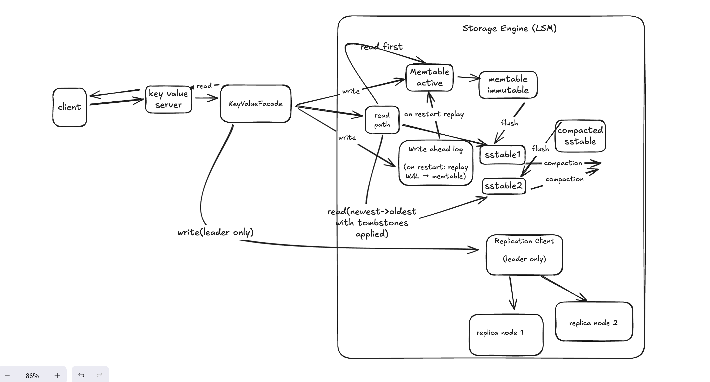

# Moniepoint Key Value Store

A lightweight persistent, replicated, and LSM-based Key/Value store built in Java using only standard libraries.
Supports:
- PUT
- READ
- READKEYRANGE
- BATCHPUT
- DELETE
- Durable crash-safe storage
- Leader -> follower replication

Designed for high write throughput, predictable read performance, and datasets larger than RAM.


## 1 Running the project
## Requirements
- Java 17+
- Gradle(wrapper included ```./gradlew```)
- macOS/Linux/Windows

## Build and Run
```bash
./gradlew clean build
```
### Running a single node
```bash
./gradlew run -Pport=8080 -Pdir=./data-8080
```
The result should be
```terminaloutput
Moniepoint Key Value Storage Server starting on port 8081, dir=./data-8081
```
Test with curl:
```shell
curl -X PUT "http://localhost:8080/keyvalue?key=test1" -d "moniepoint"
curl "http://localhost:8080/keyvalue?key=test1"
curl "http://localhost:8080/keyvalue/range?startKey=s&endKey=v"
curl -X POST "http://localhost:8080/keyvalue/batch" -d $'test2=value2\ntest3=value3\ntest4=value4'
curl -X DELETE "http://localhost:8080/keyvalue?key=test2"
```

### Running a multi node cluster (Replication enabled)
This includes a leader -> replica(s) architecture
You run 3 terminals, each launching a node
### Leader (runs on 8080 leader node and replicates writes to followers)
```bash
./gradlew run -Pport=8080 -Pdir=./data-8080
```
### Replica 1 
```shell
./gradlew run -Pport=8081 -Pdir=./data-8081
```
### Replica 2
```shell
./gradlew run -Pport=8082 -Pdir=./data-8082
```

## Test Replication
### Write to the leader
```shell
curl -X PUT "http://localhost:8080/keyvalue?key=testMultiNode" -d "moniepointMultiNode"
```
### Read from replica
```shell
curl "http://localhost:8081/keyvalue?key=testMultiNode"

Should return moniepointMultiNode if replication is working
```

### Resource Usage Notes

- Each node writes data into its own folder (`data-8080`, `data-8081`, `data-8082`).
- For normal manual testing, these directories remain small (KBs–MBs).
- If you run many experiments or long-lived tests, you can safely remove them with:

```bash
rm -rf data-8080 data-8081 data-8082
```

## 2. HTTP API

### 2.1 Current Endpoints

The current API is intentionally minimal to keep the focus on the LSM storage
engine and replication. Keys are passed as query parameters, and values are sent
as raw request bodies.

| Method | Endpoint                              | Description                                | Request Body Example              | Example Response               |
|--------|---------------------------------------|--------------------------------------------|-----------------------------------|--------------------------------|         
| PUT    | `/keyvalue?key=a`                     | Create or update a key/value               | `moniepoint`                      | `OK`                           |
| GET    | `/keyvalue?key=a`                     | Read a single key                          | _none_                            | `moniepoint`                   | 
| GET    | `/keyvalue/range?startKey=a&endKey=z` | Read a range of keys (lexicographically)   | _none_                            | `{"a":"v1","b":"v2","c":"v3"}` | 
| POST   | `/keyvalue/batch`                     | Batch insert/update (`key=value` per line) | `key1=val1\nkey2=val2\nkey3=val3` | `OK`                           | 
| DELETE | `/keyvalue?key=a`                     | Tombstone delete for a key                 | _none_                            | `OK`                           |

### 2.2 Production-Ready API (Ideal Design)

In a real production service, the API would follow standard REST conventions,
with JSON or binary request bodies, clear content types, and structured responses.

#### **Ideal production-ready endpoints**


## 2.1 Production-Ready API (Ideal Design)

A real production KV service would use structured JSON request bodies,
proper REST semantics, and predictable structured responses.

### Ideal Production-Ready Endpoints

| Method | Endpoint           | Description                                | Request Body Example                                          | Example Json Response                                                           |                            
|--------|--------------------|--------------------------------------------|---------------------------------------------------------------|---------------------------------------------------------------------------------|
| POST   | `/keyvalue`        | Create or update a key/value               | `{ "key": "k1", "value": "v1" }`                              | `{ "status": "success", "key": "k1" }`                                          |            
| GET    | `/keyvalue/k1`     | Read a single key                          | _none_                                                        | `{ "key": "k1", "value": "v1" }`                                                |
| POST   | `/keyvalue/batch`  | Batch insert/update                        | `{ "items": [{ "key": "...", "value": "..." }] }`             | `{ "status": "success", "processed": 2 }`                                       |
| GET    | `/keyvalue/range`  | Read a range of keys (lexicographically)   | _none_ (use query params for range bounds: startKey & endKey) | `{ "items": [{ "key": "a", "value": "v1" }, { "key": "b", "value": "v2" }] }`   |
| DELETE | `/keyvalue/k1`     | Tombstone delete for a key                 | _none_                                                        | `{ "status": "deleted", "key": "k1" }`                                          |

### Example JSON Error Responses
| Scenario    | Example JSON Response                   |
|-------------|-----------------------------------------|
| Missing key | `{ "error": "key is required" }`        |
| Not found   | `{ "error": "key not found" }`          |
| Bad payload | `{ "error": "invalid request body" }`   |

#### **Reasons this is better for production**
- Safer for binary data (values not restricted by URL encoding)
- Avoids issues with large query strings
- Enables schema validation and better error handling
- Allows versioning (`/v1/keyvalue`)
- Plays well with API gateways, load balancers, and caching layers
- Follows common patterns used by cloud KV services (DynamoDB, Redis Enterprise REST, etc.)

#### **Why the simplified API was chosen here**
The assignment focuses specifically on:

- storage engine internals
- persistence
- crash recovery
- range queries
- replication

So, to keep the implementation concise and highlight the core LSM architecture,
the API uses a minimal request format.  
The system is layered such that the HTTP interface can be upgraded without
changing any storage engine logic.


## 3 System Architecture
The implementation uses a Log-Structured Merge Tree (LSM-Tree) architecture, a type of design used in:
Cassandra, Elasticsearch segment writes, Kafka Streams state stores

It satisfies the tasks strict constraints:
- high write throughput
- low read latency
- durable persistence
- crash recovery
- datasets larger than RAM
- predictable behavior under load

## Key Design Decisions & Trade-offs

- **LSM-based engine instead of Bitcask**
  - Handles large datasets: Bitcask requires the entire key index in memory; LSM only keeps the Memtable + sparse indexes, allowing data much larger than RAM.
  - High write throughput: LSM optimizes for heavy write workloads through sequential WAL appends and immutable SSTables.
  - Supports range reads: LSM stores keys in sorted order, making ReadKeyRange efficient. Bitcask does not support range queries natively.
  - Predictable performance over time: Compaction keeps read paths predictable even as data grows.
  - Fast crash recovery: WAL replay + existing SSTables yields stable recovery behavior.

Overall, LSM provides better scalability and read/write performance for this task compared to Bitcask.
- **Append-only WAL + immutable SSTables**
  Prioritizes sequential I/O and predictable recovery over in-place updates.

- **Async, best-effort replication**
  Chosen for simplicity and high availability over strict consistency. The leader is the source of truth; replicas are eventually consistent.

- **Single leader, fixed topology**
  Avoids the complexity of leader election and consensus (Raft/Paxos) for this assignment’s scope, but the design can evolve towards Raft in the future.

- **No sharding / partitioning**
  The system runs as a single shard per node. Horizontal scalability via partitioning is deliberately left as future work.

## Architecture Diagram



## Storage Engine Design
### 3.1 Write Implementation (PUT, BATCHPUT, DELETE)
#### 1. Write Ahead Log
Every write is first appended to a Write ahead log file. This enables
- append only
- sequential disk writes
- filesync after every N operations(hardcoded but can be made configurable in future iterations)
- enables crash recovery

#### 2. Memtable (in memory sorted tree)
After the write ahead log append, then we have
- key/value inserted into the mem table
- memtable is small and bounded
- extremely fast writes (O(logn))

#### 3. SStable
When memtable reaches max size:
- sorted entries are flushed into a new immutable SSTable file
- Write ahead log is truncated
- memtable is then cleared

### 3.2 SSTable (Immutable Sorted String Table)
Each SSTable stores:
- entries sorted by key
- sparse index for fast binary lookup (every 100 keys)

Reads check:
1. Memtable
2. Write Ahead Log (replayed memtable)
3. SStables(from newest -> oldest)

### 3.3 Compaction
To keep reads fast and storage bounded, multiple SSTables are periodically merged:
- newest version of each key wins
- tombstones remove deleted entries
- output is a single SSTable
- old SSTables deleted

This ensures:
- predictable read performance
- low disk fragmentation
- efficient range lookups
- datasets larger than RAM are handled gracefully

### 3.4 Crash Recovery
On startup:
1. Load all existing SSTables
2. Replay Write Ahead log (append log)
3. Rebuild memtable from Write Ahead log
4. Continue serving data

## 4 Replication
Replication Model: Leader -> Followers
The leader forwards writes to replicas using:
- Java HttpClient
- non blocking so replication never blocks the client request in the form of fire and forget

## 5 Transport
Although HttpClient was implemented as the transport mechanism in this project, the interface is open for other transport implementation


## 6 Test
Run unit tests:
```shell
./gradlew test
```
Tests cover:
- Put
- Read
- Read key range
- BatchPut
- Delete
- WAL replay

## 7 Future Improvements
### Storage Engine
- Background compaction to keep foreground latencies stable.
- Bloom filters on SSTables to skip unnecessary disk reads.
- Block indexing & caching for lower disk IO.
- Dual memtables (active + immutable) for smoother flush behavior.

### Replication
- Health checks to avoid replicating to unhealthy nodes.
- Configurable write concern (leader-only, leader+1, all).
- Simple failover using heartbeats and replica promotion.

### Resilience & Concurrency
- Backpressure to protect the system under overload.
- Per-request timeouts to prevent long hangs.

### Consistency & Consensus
The current design deliberately keeps consensus out of scope: there is a single configured leader that forwards writes to replicas on a best-effort basis. This provides simple, eventual consistency but does not handle automatic failover or split-brain scenarios.
In a production-ready system, the next step would be to introduce a consensus protocol such as **Raft**:
- **Automatic leader election & failover**: nodes vote to elect a leader and promote a follower if the leader becomes unavailable.
- **Quorum-based commits**: writes are only considered committed once a majority of replicas have persisted the log entry.
- **Fencing tokens / terms**: prevent an old leader from accepting writes after it has lost leadership, avoiding split-brain.
- **Stronger consistency guarantees**: linearizable reads/writes and well-defined semantics across node failures and network partitions.

These mechanisms would move the system from a simple, single-leader replicated store to a fully consistent, fault-tolerant distributed database.


### Observability
- Metrics of compaction time, Write ahead log write rate, latency percentile (P95, P99)
- Structured logs
- Rate limiting during peak or overloads

### Configuration
Move all hardcoded values into config

### Deployment
- Docker and Docker compose to run multi-node clusters easily
- Data directory management for safer production operation 

## Limitations & Non-goals

- No automatic failover / consensus
  If the leader dies, a new leader must be chosen manually. Protocols like Raft are intentionally out of scope.

- Eventual consistency on replicas
  Replicas might briefly serve stale data. Strong consistency across nodes is not guaranteed.

- No authentication / encryption
  The focus is on storage and replication mechanics, not security. In a real deployment, TLS, authN/authZ, and network isolation would be required.

- No strict SLAs
  There is no adaptive backpressure or autoscaling; the system is not tuned for hard latency/availability SLOs yet.
